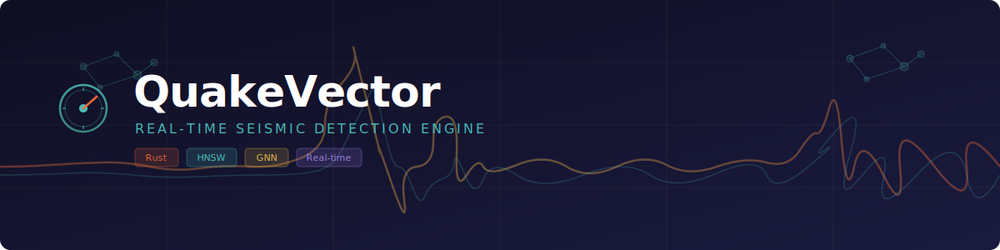

<p align="center">
  
</p>

<p align="center">
  <a href="https://www.rust-lang.org/"></a>
  <a href="LICENSE"></a>
  <a href="#crate-map"></a>
  <a href="#testing"></a>
</p>

<p align="center">
  A production-grade seismic event detection system built in Rust.<br/>
  Processes raw waveform data in real time using HNSW graphs, graph neural networks,<br/>
  and multi-station consensus to detect earthquakes with sub-second latency.
</p>

---

## Features

- **Real-time waveform processing** — 1 kHz sample ingestion with lock-free ring buffers and automatic P/S/Surface wave classification
- **256-dimensional embeddings** — FFT spectral features, Hilbert envelope, STA/LTA arrival detection, phase coherence, and positional encoding
- **HNSW approximate nearest-neighbor search** — hierarchical navigable small-world graph with configurable M, ef, and tiered hot/warm/cold storage
- **GNN causal inference** — graph attention network over temporal subgraphs to detect seismic wave propagation patterns
- **SONA three-speed learning** — self-organizing network adaptation with micro-LoRA (fast), base-LoRA (medium), and drift correction (slow) rates
- **Multi-station consensus** — cryptographically signed claims, mesh peer confirmation, cooldown deduplication
- **Crash-safe persistence** — write-ahead logging, 3-slot checkpoint rotation, Ed25519 integrity verification, wear-leveled flash writes
- **Production hardening** — hardware watchdog, `SCHED_FIFO` real-time scheduling, CPU pinning, GPIO alert relays, graceful degradation
- **HTTP dashboard** — live health, prediction history, and alert monitoring via Axum REST endpoints
- **Optional ruvector ecosystem** — feature-gated adapters for `rvf-index`, `ruvector-gnn`, `ruvector-sona`, and `rvf-crypto`

## Architecture

<p align="center">
  
</p>

### Crate Map

| Crate | Purpose |
|:------|:--------|
| **`types`** | Shared domain types — `WaveformWindow`, `SeismicEmbedding`, `SeismicPrediction`, `Alert`, and 7 newtype IDs |
| **`ingestion`** | Sensor discovery, ring-buffered sample capture, wave classifier, health monitoring, event simulator |
| **`embedding`** | FFT features, envelope extraction, arrival detection, phase coherence, positional encoding, int8 quantization |
| **`vector-store`** | HNSW graph with insert/k-NN search, cosine distance, tier management, `VectorStore` trait |
| **`learning`** | Temporal subgraph construction, GAT attention layers, transition matrices, causal model inference |
| **`adaptation`** | Micro-LoRA + base-LoRA deltas, ground-truth labeling, probation tracking, SONA engine |
| **`alert`** | Threshold evaluation, alert decisions, consensus manager, cooldown, GPIO relay control |
| **`persistence`** | WAL writer/reader, checkpoint manager, Ed25519 crypto, wear monitor, graph/SONA serializers |
| **`container`** | Boot sequencer, runtime orchestrator, resource monitor, graceful degradation, watchdog, thread health |
| **`network`** | Mesh peer management, signed message protocol, upstream relay, bounded queues, Axum dashboard |

## Getting Started

### Prerequisites

- **Rust** 1.75 or later
- **Cargo** (included with Rust)

### Build

```bash
# Debug build
cargo build

# Optimized release build (LTO + single codegen unit)
cargo build --release
```

### Run

```bash
# Run with defaults (1 simulated sensor, station ID 1)
cargo run --release

# Run with custom configuration
cargo run --release -- \
  --station-id 42 \
  --sensor-count 3 \
  --data-dir /var/lib/quakevector \
  --duration 3600 \
  --dashboard \
  --production
```

### CLI Options

| Flag | Default | Description |
|:-----|:--------|:------------|
| `--config <PATH>` | — | Path to TOML configuration file |
| `--data-dir <PATH>` | `/data` | Persistent storage directory |
| `--station-id <ID>` | `1` | Station identifier |
| `--sensor-count <N>` | `1` | Number of simulated sensors |
| `--duration <SECS>` | `0` (forever) | Run duration in seconds |
| `--dashboard` | off | Enable HTTP dashboard on `127.0.0.1:8080` |
| `--production` | off | Enable watchdog, `SCHED_FIFO`, CPU pinning, GPIO |

### Dashboard API

When `--dashboard` is enabled, the following endpoints are available:

```
GET /health         — Station status, uptime, node count, degradation level
GET /predictions    — Recent predictions (limit via ?limit=N, default 50)
GET /alerts         — Recent alerts
```

## Testing

```bash
# Run all unit tests (190+ tests across 10 crates)
cargo test --workspace --lib

# Run integration and e2e tests
cargo test --test integration_test
cargo test --test e2e_simulation

# Run with ruvector ecosystem adapters
cargo test -p quake-vector-store --features ruvector
cargo test -p quake-vector-learning --features ruvector
cargo test -p quake-vector-adaptation --features ruvector
cargo test -p quake-vector-persistence --features rvf

# Run without any default features
cargo test --workspace --lib --no-default-features
```

### Test Coverage

| Suite | Tests | What it covers |
|:------|------:|:---------------|
| Unit tests | 190 | All 10 library crates — ring buffers, FFT, HNSW insert/search, GAT layers, LoRA deltas, consensus, WAL round-trips, checkpoint recovery, wear leveling, GPIO, watchdog, dashboard endpoints |
| Integration | 3 | Boot sequence, tick processing, checkpoint persistence |
| End-to-end | 4 | Full event detection, false-positive control, checkpoint recovery (cold/warm boot), multi-station consensus |

## Benchmarks

```bash
cargo run --release --example bench
```

Runs five latency benchmarks with warmup, reporting mean/P50/P99:

| Benchmark | What it measures |
|:----------|:-----------------|
| `embedding_latency` | Full FFT to feature extraction to quantization pipeline |
| `hnsw_insert_latency` | Single-node insert into a 10K-node graph |
| `hnsw_search_latency` | k-NN search (k=16, ef=64) over 10K nodes |
| `gnn_inference_latency` | Causal learner subgraph construction + GAT inference |
| `full_pipeline_latency` | Window to embedding to HNSW insert to GNN inference |

## Feature Flags

QuakeVector uses Cargo feature flags to optionally integrate with the [ruvector](https://crates.io/search?q=ruvector) ecosystem:

| Feature | Crate | Enables |
|:--------|:------|:--------|
| `ruvector` | `vector-store` | `RuvectorHnswGraph` via `rvf-index` ProgressiveIndex |
| `ruvector` | `learning` | `RuvectorCausalModel` via `ruvector-gnn` + `ruv-fann` |
| `ruvector` | `adaptation` | `RuvectorSonaEngine` via `ruvector-sona` |
| `rvf` | `persistence` | `RvfAvailable` via `rvf-runtime` + `rvf-crypto` |

Custom implementations are the default. The adapter pattern ensures domain logic is unaffected by the choice of backend.

## Production Deployment

### Hardware Watchdog

In `--production` mode, QuakeVector opens `/dev/watchdog` and feeds it every 2 seconds. If the main loop stalls or thread health checks detect a frozen worker, the watchdog stops being fed, triggering a hardware reset.

### Graceful Degradation

The runtime monitors CPU, memory, and disk utilization and automatically adjusts behavior:

| Level | Trigger | Response |
|:------|:--------|:---------|
| **Normal** | Utilization < 70% | Full inference, all alert levels |
| **Mild** | 70-85% | Reduced search ef, drop low-confidence predictions |
| **Severe** | 85-95% | Further search reduction, suppress Low alerts |
| **Critical** | > 95% | Minimal inference, essential consensus only |

### Wear Leveling

The wear monitor tracks daily write volume against a configurable budget (default 10 GB) and dynamically adjusts checkpoint intervals:

| Utilization | Checkpoint interval |
|:------------|:-------------------|
| < 80% | Default (15 min) |
| 80-95% | 2x default |
| > 95% | 4x default |

### GPIO Alert Indicators

On Linux with GPIO access, physical indicators activate by alert level:

| Level | Pin 17 (Amber) | Pin 27 (Red) | Pin 22 (Buzzer) |
|:------|:-----:|:---:|:------:|
| Low | — | — | — |
| Medium | ON | — | — |
| High | — | ON | — |
| Critical | — | ON | ON |

## Project Structure

```
quake-vector/
├── Cargo.toml               # Workspace root
├── src/main.rs               # Binary entry point + CLI
├── crates/
│   ├── types/                # Shared domain types
│   ├── ingestion/            # Sensor ingestion pipeline
│   ├── embedding/            # Waveform → vector embedding
│   ├── vector-store/         # HNSW graph engine
│   ├── learning/             # GNN causal inference
│   ├── adaptation/           # SONA three-speed learning
│   ├── alert/                # Alert decisions + consensus
│   ├── persistence/          # WAL + checkpoints + crypto
│   ├── container/            # Runtime + boot + degradation
│   └── network/              # Mesh + upstream + dashboard
├── tests/
│   ├── integration_test.rs   # Boot and tick integration tests
│   └── e2e_simulation.rs     # Full system simulation tests
└── examples/
    └── bench.rs              # Latency benchmarks
```

## Release Profile

The release build is optimized for embedded and edge deployment:

```toml
[profile.release]
opt-level = 3
lto = true
codegen-units = 1
panic = "abort"
strip = true
```

## License

This project is licensed under the [MIT License](LICENSE).
